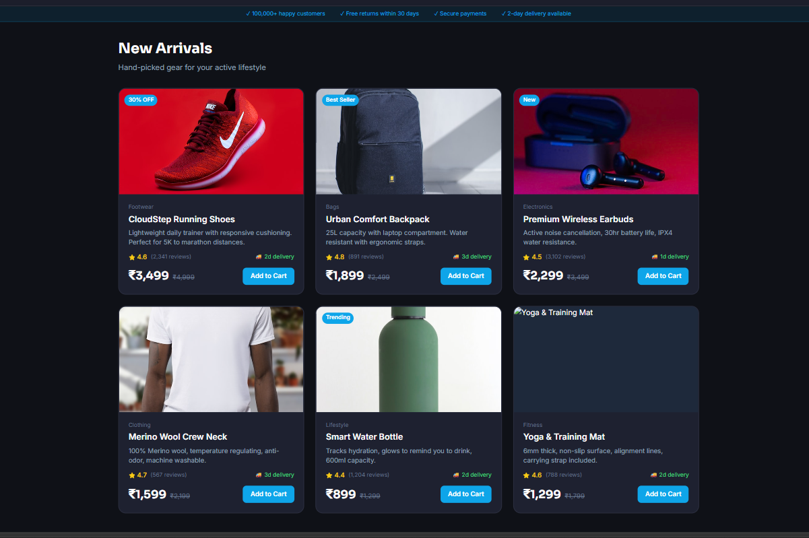
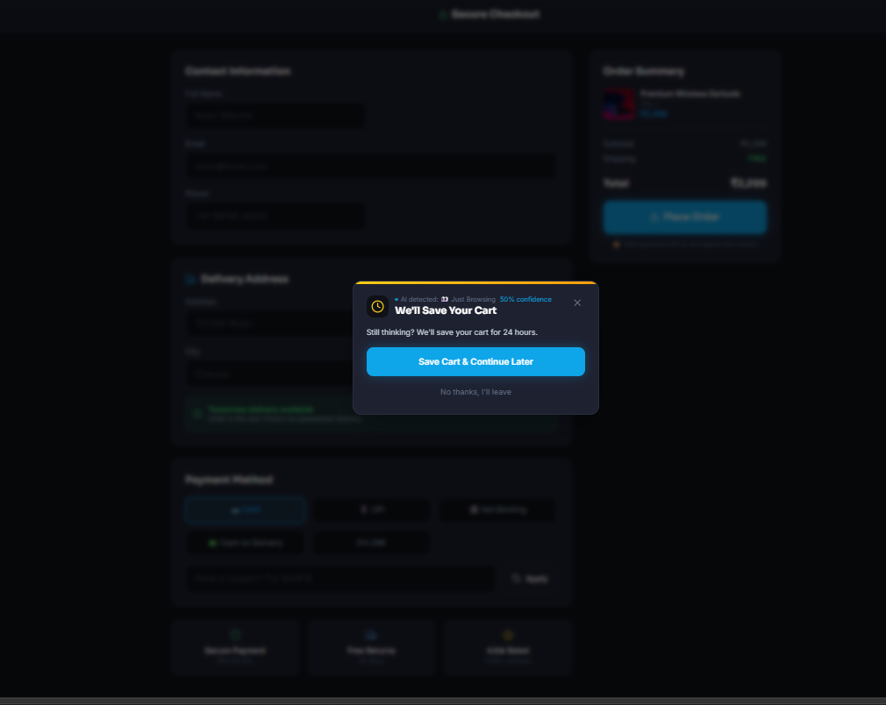
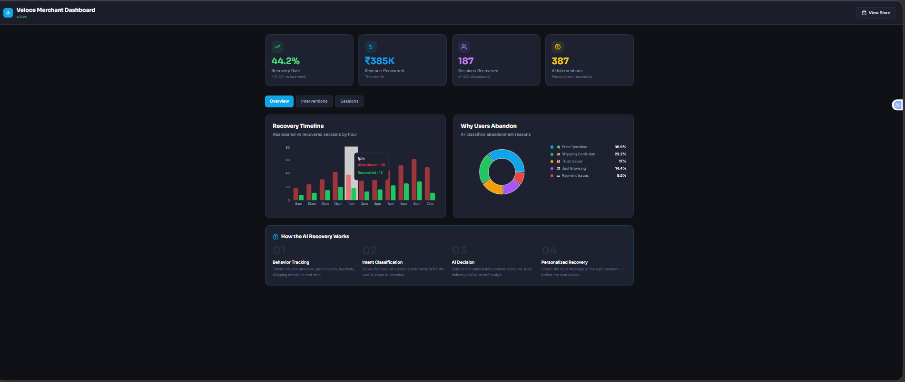
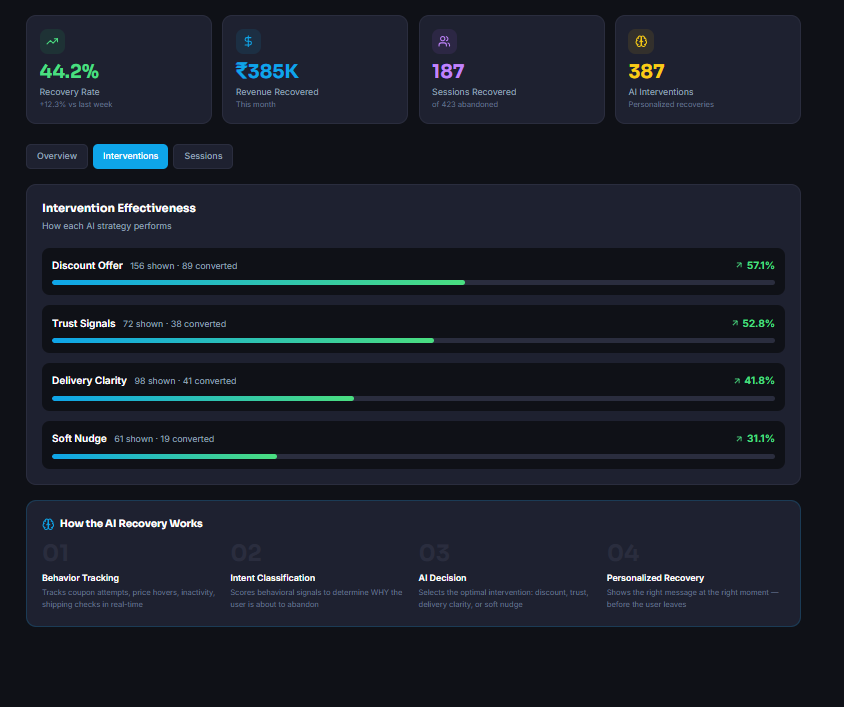
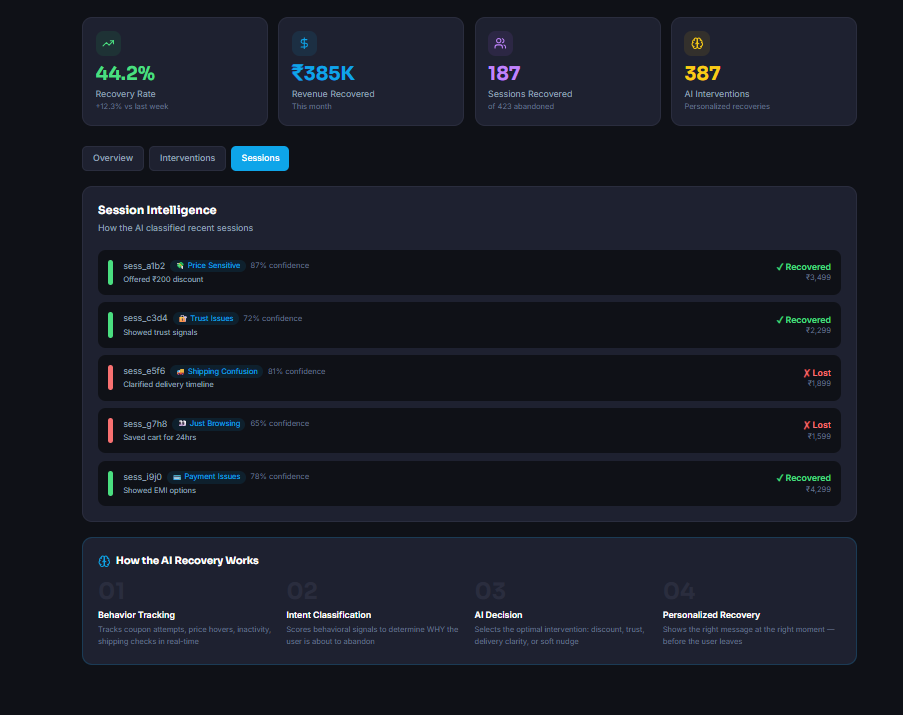

# 🛒 AI Checkout Recovery Agent

**Kasparro Agentic Commerce Hackathon — Track 2: AI-Assisted Checkout Recovery**

> An AI agent that detects *why* users abandon checkout in real-time, classifies intent, and intervenes with personalized recovery strategies — before they leave.

---

## 💡 Problem Statement

Cart abandonment is one of the largest revenue leaks in ecommerce. Most solutions rely on delayed recovery methods like emails or retargeting — after the user has already left.

There is no real-time system that understands *why* a user hesitates during checkout and proactively resolves that friction.

---

## 🚀 Solution Overview

This project introduces an **AI-powered checkout recovery system** that:

* Tracks behavioral signals in real-time
* Classifies user intent (price sensitivity, trust issues, etc.)
* Intervenes with targeted strategies
* Provides merchant analytics via a dashboard

👉 Prevents drop-off *before it happens*

---

## 🎥 Demo Video

https://drive.google.com/file/d/16Xluew0UbKGyryWcE6zX0fOHqwNDdeJ4/view

---

## 📸 Screenshots

### 🏬 Product Store



### 💳 Checkout + Recovery Trigger



### 📊 Merchant Dashboard Overview



### ⚡ Intervention Effectiveness



### 🧠 Session Intelligence



---

## ⚡ Quick Start

```bash
git clone https://github.com/Shreya-c17/Kasparro-Hackathon
cd Kasparro-Hackathon
npm install
npm run dev
```

Open: http://localhost:3000

---

## 🏗️ Project Structure

```
src/
├── app/
│   ├── store/page.tsx
│   ├── checkout/page.tsx
│   ├── dashboard/page.tsx
│   └── api/
├── components/
├── lib/
└── types/
```

---

## 🧠 How the System Works

### 1. Behavior Tracking

Tracks:

* Coupon attempts
* Price hovers
* Shipping checks
* Payment hesitation
* Exit intent
* Inactivity

---

### 2. Intent Classification

| Signal             | Reason             |
| ------------------ | ------------------ |
| Coupon attempts    | Price Sensitive    |
| Shipping checks    | Shipping Confusion |
| Back navigation    | Trust Issues       |
| Inactivity         | Just Browsing      |
| Payment hesitation | Payment Issues     |

---

### 3. Recovery Strategies

| Intent             | Action            |
| ------------------ | ----------------- |
| Price Sensitive    | Discount          |
| Trust Issues       | Reviews / Policy  |
| Shipping Confusion | Delivery clarity  |
| Just Browsing      | Save cart         |
| Payment Issues     | Alternate payment |

---

## ⚙️ AI vs Deterministic Logic

* AI → interprets behavior patterns
* Logic → tracks events, scoring, triggers actions

---

## ⚠️ Failure Handling

* AI unavailable → rule-based fallback
* Missing data → last known signals
* No clear intent → generic recovery
* API failure → no UI break

---

## 📊 Merchant Value

* Reduces cart abandonment
* Improves conversion
* Provides actionable insights

---

## 📋 Submission Checklist

* [x] Product Document
* [x] Technical Document
* [x] Decision Log
* [x] Working code
* [x] Demo video
* [x] Screenshots
* [x] Contribution note

---

## 👥 Contribution Note

**Shreya C**

* Led product thinking, system design, and implementation
* Built core features: tracking, classification, recovery system
* Developed UI, dashboard, and logic
* Authored all documentation

**Sonal M Jakhar**

* Contributed to testing and validation
* Assisted in UI refinement and usability improvements
* Supported documentation review
* Helped prepare demo assets

---

## 🧩 Decision Log

* Real-time intervention > post-abandonment emails
* Hybrid AI + rules for reliability
* Focus on behavior signals over static data

---

## 👤 Team

* Shreya C
* Sonal M Jakhar

---

*Kasparro Agentic Commerce Hackathon | April 2026*
